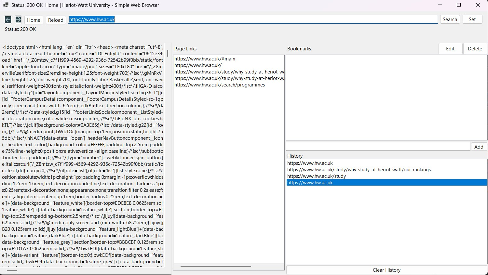

# Simple Web Browser in C#

## Overview
A desktop web browser application built in C# as part of an industrial programming coursework project.

## Features
- Basic web navigation
- Bookmark management
- Browser history tracking
- Homepage reset functionality
- Windows desktop user interface

## Technologies Used
- C#
- .NET 8
- Windows Forms
- HtmlAgilityPack

## Project Structure
- `src/SimpleWebBrowser/` — application source code
- `screenshots/` — project screenshots

## Screenshot

## How to Run
1. Clone the repository
2. Open `SimpleWebBrowser.sln` in Visual Studio
3. Build and run the project

## What I Learned
- Building a desktop GUI application in C#
- Managing bookmarks, history, and homepage data
- Organizing a .NET project for source control and portfolio presentation
